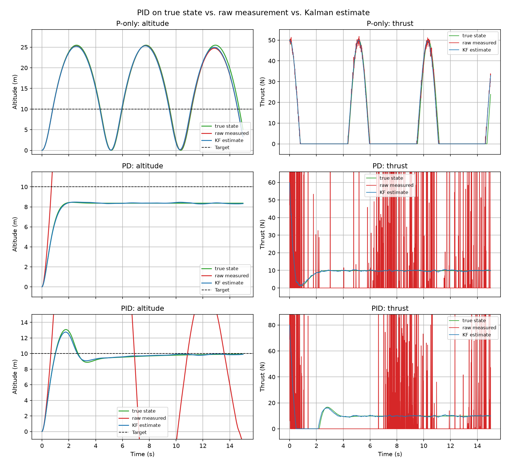

# 1D Quadrotor Altitude: PID + Kalman Filter

Vertical altitude control for a quadrotor, in Python. Started as a plain PID
controller, then bolted a Kalman filter on top so the controller runs on an
estimate of altitude and velocity instead of the raw, noisy sensor reading.

The whole thing is really about one problem: a PID's derivative term
differentiates whatever you feed it, and differentiating a noisy signal makes
the noise worse, not better. So the raw-measurement controller chatters. The
Kalman filter sidesteps it by estimating velocity as part of the state instead
of differencing the position signal.

Three controllers, each run on the true state, the raw measurement, and the
Kalman estimate:

## What happens

**P-only** just oscillates forever. It's an undamped double integrator, so
that's textbook simple harmonic motion, nothing to fix, it's supposed to fail.

**PD** settles, but lands short of the 10 m target at about 8.37 m. That gap
isn't a bug. Without a gravity feedforward term, PD needs a standing error to
generate the thrust that holds it up, and that error works out to `g / kP`. With
`kP = 6` that's `9.81 / 6 = 1.635 m`, so it settles at 8.365. The plot lands
right on it.

**PID** actually hits the target, because the integral term quietly supplies the
constant thrust that cancels gravity. Worth noting it settles at 9.87, not a
clean 10, the integral is still crawling the last bit of the way in at 15 s.

## The part I didn't expect

The Kalman predict step feeds it the commanded acceleration. I first wrote it
with `a = 0`, figuring constant-velocity was a safe default, and it blew up in
every configuration. P-only got pumped past 130 m, PD parked itself at a huge
positive bias. The reason: with `a = 0` the filter can't see the drone
accelerating, so the estimate lags the truth, and a lagging estimate inside a
feedback loop is destabilizing. Feeding the actual input fixes it. Small line,
big consequence, and the thing I learned most from.

## Run it

    pip install numpy matplotlib
    python sim.py

This writes `comparison.png`, the figure shown above.

## Files

- `sim.py` — the sim
- `comparison.png` — the figure
